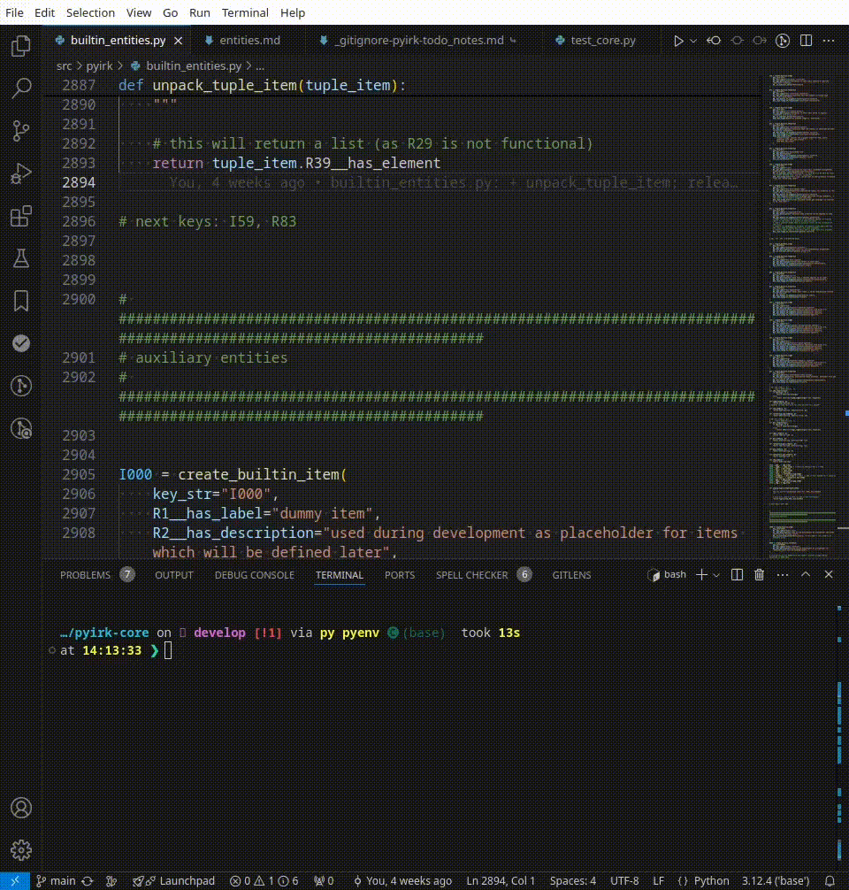

# irk-fzf

This is an experimental vs code extension to enable autocompletion support for [pyerk](https://github.com/ackrep-org/pyirk-core).
It is heavily based on:

- <https://github.com/tatosjb/vscode-fuzzy-search>
- <https://code.visualstudio.com/api/get-started/your-first-extension>.


**Note:** This extension originally was named "erk-fzf". For backward compatibility the internal command (action) is thus still named `erk-fzf.search` (see below).


## Installation

For users, to install a `.vsix` file in VS Code:

- Download the latest version from the [releases](releases) section.
- In VS Code or Codium:
    - Go to the Extensions view.
    - Click the `···`-menu (**Views and More Actions...**)
    - Select **Install from VSIX...**

Alternatively in your terminal, run the following command:

- `code --install-extension erk-fzf-0.2.2.vsix`

**Strongly recommended:**

- Bind action `erk-fzf.search` to a keyboard custom keyboard shortcut (e.g. `ctrl+shift+space`)
    - Add the following snippet to your keyboard shortcut file, e.g. `~/.config/Code/User/keybindings.json`:
    ```
    {
        "key": "ctrl+shift+space",
        "command": "erk-fzf.search"
    },
    ```
    - Alternatively you can use the keybinding dialog of VS code.

## Usage

### Preparation

- Ensure `pyirk --version` >= `0.9.0`-
- Navigate to the directory of your erk package (where `irkpackage.toml` is located)
- Create a autocompletion file (`.ac_candidates.txt`) with `pyerk --load-mod my_mod.py mm -ac`
- The file `.ac_candidates.txt` is necessary for every project irk-fzf is used for.


### Fuzzy Autocompletion

The command `erk-fzf.search` takes a string as input and performs a fuzzy search `.ac_candidates.txt` (containing keys, labels and descriptions).
The results are ordered according to matching quality. The desired result can be selected via arrow-keys and *return*.

The initial input string is the whitespace-delimited string left of the cursor. While the dialog window of the extension is open
further characters can be entered to refine the result. See the following example:




## Development of this Extension

### Test

Inside the editor, open `src/extension.ts` and press `F5`. This will compile and run the extension in a new Extension Development Host window.

Run the `erkfzf` command from the Command Palette (`Ctrl+Shift+P`) in the new window:

See also [vsc-extension-quickstart.md](vsc-extension-quickstart.md).
ing of your choice


### Build package

- from the root dir of the extension:
    - `npm install`
    - `npm install -g @vscode/vsce`
    - `vsce package`
    - this creates a file like `extensionname.vsix`
